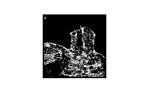
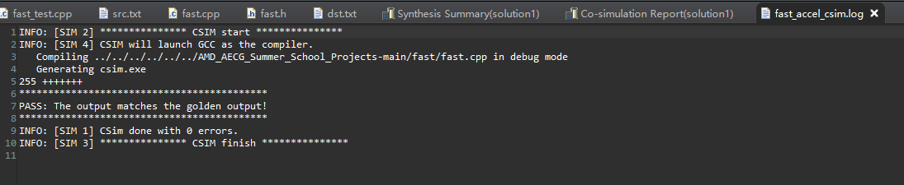

## 赛灵思2022暑期学校作业提交：FAST角点检测算法提取图像的角点

1. 原始图像与FAST角点检测Golden结果

   

    
    

   

    
    

2. C Simulation结果

    

    
    

3. HLS代码参见src目录
4. HLS联合仿真和综合生成的报告参见report目录
5. Bit和hwh文件参见overlay目录
6. Jupyter上板演示结果参见jupyter目录

### Author：曹城华
### Email：1806804825@qq.com
### Phone: 17319778825
